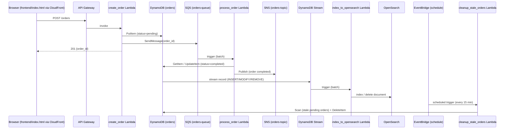

# Architecture

## Data flow

**Why this shape**: DynamoDB is the single source of truth (cheap, fast, simple). Every other
side effect - notification, search index, cleanup - is driven asynchronously off that write,
via SQS or DynamoDB Streams, rather than `create_order` doing everything synchronously. If
`process_order` or `index_to_opensearch` fails or lags, the order still exists safely in
DynamoDB; nothing is lost, only delayed.

## IAM - least privilege per function

| Role | Can do | Cannot do |
|---|---|---|
| `create-order-role` | `dynamodb:PutItem`, `sqs:SendMessage` | Read/update/delete orders, publish to SNS, touch OpenSearch |
| `process-order-role` | `sqs:ReceiveMessage/DeleteMessage`, `dynamodb:GetItem/UpdateItem`, `sns:Publish` | Create new orders, scan the table, touch OpenSearch |
| `index-opensearch-role` | Read the DynamoDB Stream, `es:ESHttp*` on this project's domain only | Write to DynamoDB directly, touch SQS/SNS |
| `cleanup-orders-role` | `dynamodb:Scan`, `dynamodb:DeleteItem` | Create/update orders, touch messaging or search |

Every role is scoped by ARN to *this project's* resources only (table/queue/topic/domain name
includes `${pProjectName}-${pEnvironment}`), not wildcarded across the account.

## Multi-account simulation

Even testing against a single AWS account initially, the project is structured as if
dev/staging/prod were separate accounts:
- Jenkins credentials are bound per-environment (`aws-dev`, `aws-staging`, `aws-prod`), never
  one shared key used everywhere.
- `cloudformation/params/{dev,staging,prod}.json` keep environment-specific config separate.
- `prod.json` sets `pFrozen: true` by default - `deploy_stack.sh` refuses to deploy there
  without an explicit `--force`.

## Known simplifications (deliberate, not oversights)

These were called out and agreed on while building the project - noted here so they don't get
mistaken for bugs later:

- **`cleanup_stale_orders` uses a full DynamoDB `Scan`**, not a Query against a GSI on
  `status`. Fine at this project's item count; a production version would add a
  `status`-keyed GSI so cleanup doesn't read the whole table every 15 minutes.
- **OpenSearch is a single `t3.small.search` node**, no dedicated master, no multi-AZ - runs
  ~$25-30/month while deployed. `scripts/cleanup_resources.sh` exists specifically so this
  doesn't run 24/7 unnecessarily.
- **`pFrozen` is enforced only by `deploy_stack.sh` itself**, not by a CloudFormation Stack
  Policy - it protects deploys that go through this script/pipeline, not a raw
  `aws cloudformation update-stack` call that bypasses it. A real production setup would likely
  want both.
- **No separate Jenkins agent container** - the pipeline runs on the controller's own
  built-in node via `jenkins/docker-compose.yml`. The `selectAgent()` load-balancing logic in
  the Jenkinsfile is real, but with one local node connected there's nothing to actually
  balance between - it's written for the multi-agent case the job posting describes, not
  exercised meaningfully by this local setup.
- **Jenkins shared-library logic (`selectAgent`, `rollbackStacks`) is inlined directly in the
  Jenkinsfile**, not in a `vars/` folder loaded from a separate Global Pipeline Library repo -
  keeps the whole pipeline runnable from this one repo with zero extra Jenkins configuration
  beyond credentials and one script-approval step.
